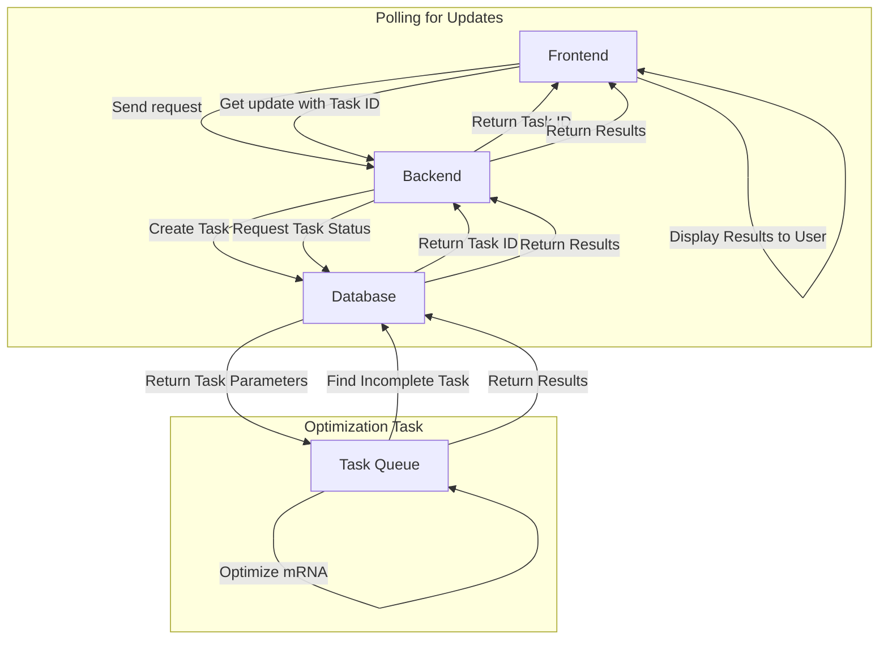
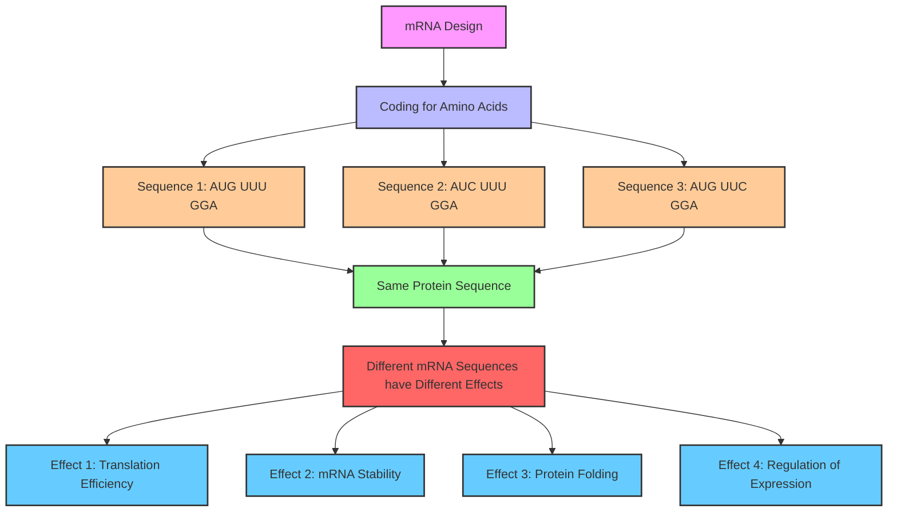
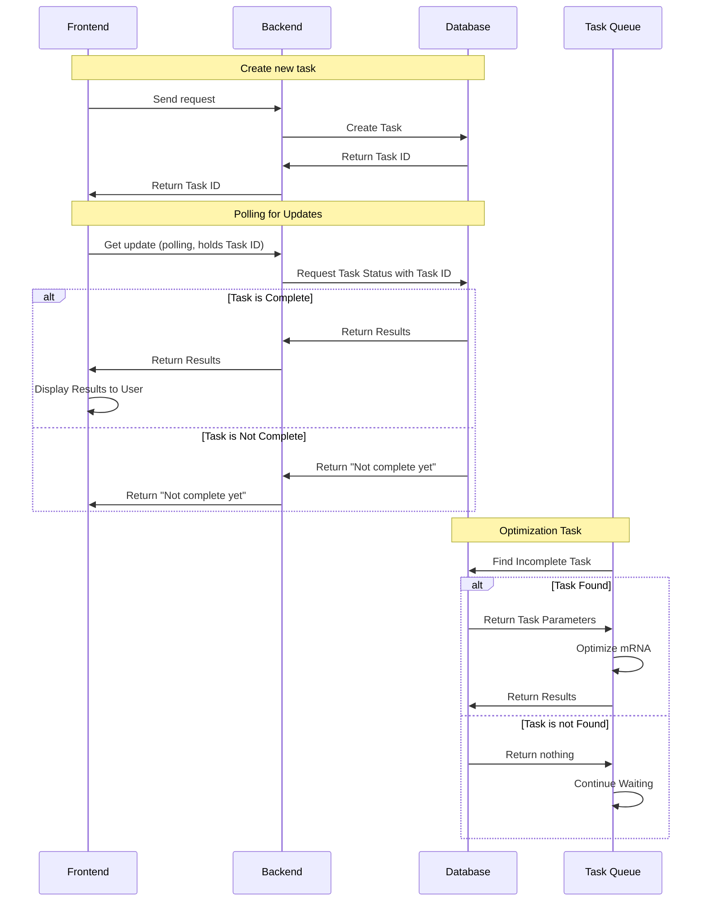
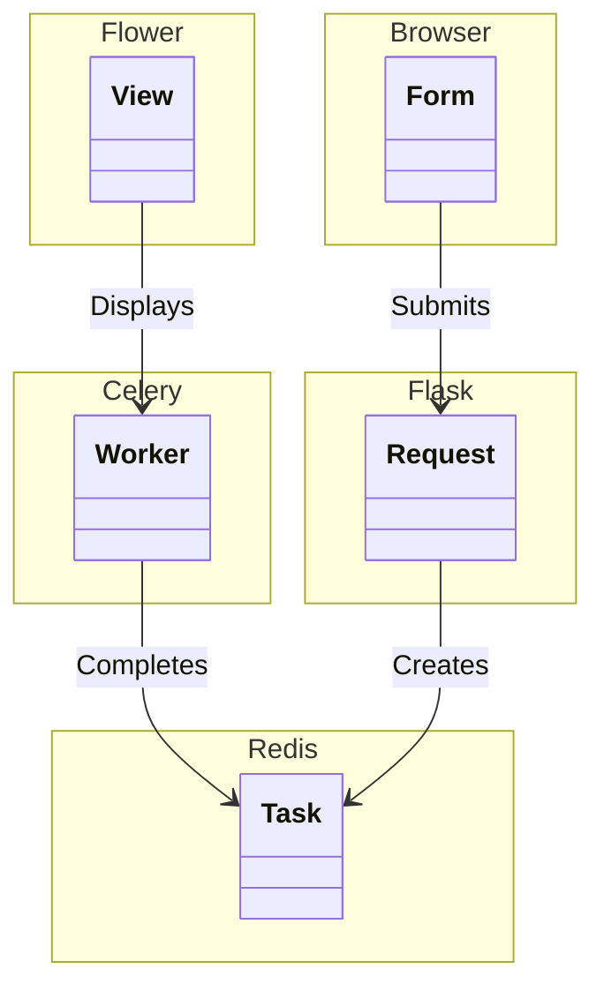

```mermaid
flowchart TD
    A[Frontend] -->|Send request| B[Backend]
    B -->|Create Task| C[Database]
    C -->|Return Task ID| B
    B -->|Return Task ID| A
    
    subgraph Polling for Updates
        A -->|Get update with Task ID| B
        B -->|Request Task Status| C
        C -->|Return Results| B
        B -->|Return Results| A
        A -->|Display Results to User| A
    end

    subgraph Optimization Task
        D[Task Queue] -->|Find Incomplete Task| C
        C -->|Return Task Parameters| D
        D -->|Optimize mRNA| D
        D -->|Return Results| C
    end
```

```mermaid
graph TD
    A[mRNA Design] --> B[Coding for Amino Acids]
    B --> C1[Sequence 1: AUG UUU GGA]
    B --> C2[Sequence 2: AUC UUU GGA]
    B --> C3[Sequence 3: AUG UUC GGA]
    C1 --> D1[Same Protein Sequence]
    C2 --> D1[Same Protein Sequence]
    C3 --> D1[Same Protein Sequence]
    D1 --> E[Different mRNA Sequences have Different Effects]
    E --> F[Effect 1: Translation Efficiency]
    E --> G[Effect 2: mRNA Stability]
    E --> H[Effect 3: Protein Folding]
    E --> I[Effect 4: Regulation of Expression]

    style A fill:#f9f,stroke:#333,stroke-width:2px;
    style B fill:#bbf,stroke:#333,stroke-width:2px;
    style C1 fill:#fc9,stroke:#333,stroke-width:2px;
    style C2 fill:#fc9,stroke:#333,stroke-width:2px;
    style C3 fill:#fc9,stroke:#333,stroke-width:2px;
    style D1 fill:#9f9,stroke:#333,stroke-width:2px;
    style E fill:#f66,stroke:#333,stroke-width:2px;
    style F fill:#6cf,stroke:#333,stroke-width:2px;
    style G fill:#6cf,stroke:#333,stroke-width:2px;
    style H fill:#6cf,stroke:#333,stroke-width:2px;
    style I fill:#6cf,stroke:#333,stroke-width:2px;
```

```mermaid
sequenceDiagram
    participant Frontend
    participant Backend
    participant Database
    participant Task Queue

    Note over Frontend, Database: Create new task
    Frontend->>Backend: Send request
    Backend->>Database: Create Task
    Database->>Backend: Return Task ID
    Backend->>Frontend: Return Task ID

    Note over Frontend, Database: Polling for Updates
    Frontend->>Backend: Get update (polling, holds Task ID)
    Backend->>Database: Request Task Status with Task ID
    alt Task is Complete
        Database->>Backend: Return Results
        Backend->>Frontend: Return Results
        Frontend->>Frontend: Display Results to User
    else Task is Not Complete
        Database->>Backend: Return "Not complete yet"
        Backend->>Frontend: Return "Not complete yet"
    end

    Note over Task Queue, Database: Optimization Task
    Task Queue->>Database: Find Incomplete Task
    alt Task Found
        Database->>Task Queue: Return Task Parameters
        Task Queue->>Task Queue: Optimize mRNA
        Task Queue->>Database: Return Results
    else Task is not Found
        Database->>Task Queue: Return nothing
        Task Queue->>Task Queue: Continue Waiting
    end
```

```mermaid
classDiagram

Worker --> Task : Completes
Form --> Request : Submits
Request --> Task : Creates
View --> Worker : Displays
namespace Redis {
    class Task {

    }
}

namespace Celery {
    class Worker {

    }
}

namespace Flower {
    class View {

    }
}

namespace Flask {
    class Request {

    }
}

namespace Browser {
    class Form
}

```
