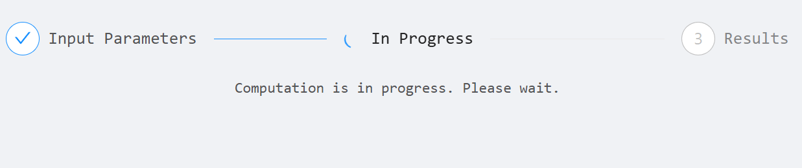
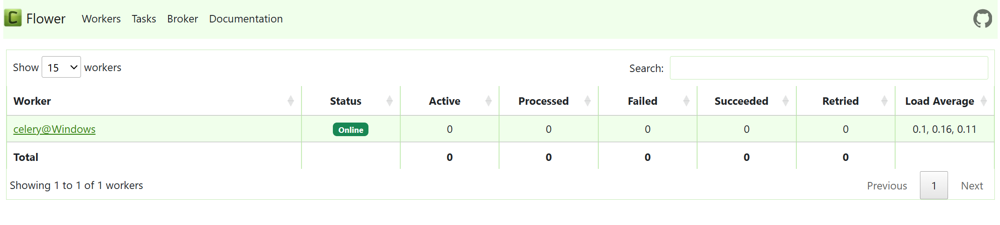

---
numbersections: true
figPrefix: "Figure "
fig-suffix: ": "
colorlinks: true
...


# Admin Guide for mRNAid Web App Deployment

Group 7 
A server for mRNA

This manual will guide you through the setup and deployment of the mRNAid web application, covering both development and production environments.

## Prerequisites

1. **Install Node.js and npm:**

    Nodejs needs to be installed to run the react server

    Installation instructions are [here](https://nodejs.org/en/learn/getting-started/how-to-install-nodejs)

1. **Install Conda or Miniconda**

    Conda is required to run the flask server, and task queue

    Installation instructions for your specific system can be found [here](https://conda.io/projects/conda/en/latest/user-guide/install/index.html)

1. **Clone the Repository**

    The repository is publically available and can be found [here](https://github.com/ryanwhite04/mRNAid)

## Requirements

1. **Create the conda environment**

    ```sh
    conda create --name mRNAid python3.9    
    ```
1. **Install python requirements**

    Install all the python packages in requiremnts.txt using conda

1. **Install redis**

    To install redis, cd into /mRNAid/mrnaid/backend/flask_app and run

    ```sh
    make redis-install
    ```

1. **Install npm packages**

    navigate to /mRNAid/mrnaid/frontend/

    ```sh
    npm install
    ```

## Startup

1. **Start the servers**

    navigate back to /mRNAid/mrnaid/backend/flask_app

    and start each server with the corresponding make command

    ```sh
    make redis-run # to start redis server
    make celery-run # to spawn celery workers
    make flower-run # to launch flower UI on port 5566
    make flask-run # to start backend server on port 5000
    make react-run # to launch react server on port 3000
    ```

    Each of the servers must be started in its own terminal
    They must also be started in the specific order outlined above

1. **Server Diagram**

    A diagram of the servers and their interaction is shown below

    

1. **Submit an optimization task**

    Navigate the [Local](http://localhost:3000) to view the frontend

    

    You can hit example to fill in an example request for testing

    

    Hitting submit will take you to the loading page

    

    And after a few seconds, the results will appear

    

    You can also open the [flower frontend](http://localhost:5566)
    
      

## ARWA Optimization

ARWA optmization form can be viewed at [http://localhost:3000/arwa_websocket](http://localhost:3000/arwa_websocket)

## Other details

The site is also hosted on digital ocean at [http://170.64.214.155:3000/](http://170.64.214.155:3000/)

## Appendix
